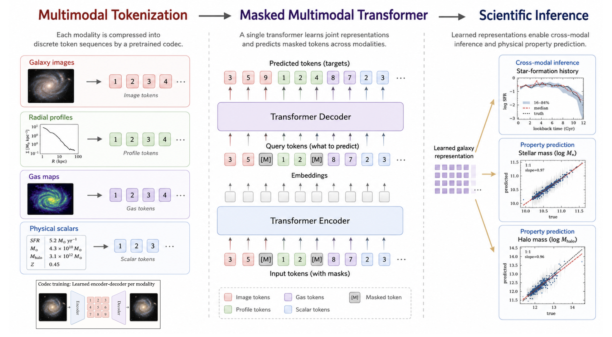
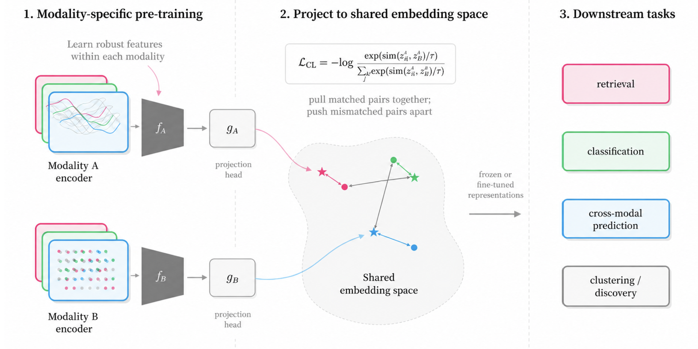

# Multimodal Learning for Galaxies

A hands-on tutorial on **multimodal representation learning for galaxies**. Each
galaxy in a cosmological simulation comes with many different "views" — a
photometric image, a star-formation history, radial density profiles, and a
handful of physical scalars. Using galaxies from the
[IllustrisTNG](https://www.tng-project.org/) **TNG-100** simulation, this
tutorial teaches two complementary ways to learn a *joint* model over all of
them:

1. **Generative — masked multimodal token modeling.** Tokenize every modality
   into discrete integers, then train a single
   [4M / AION](https://github.com/PolymathicAI/AION)-style transformer that can
   predict **any** modality from **any** other (Tutorials 1–2).
2. **Contrastive — representation alignment.** Train two encoders so that the
   image and star-formation history of the *same* galaxy land at the same place
   in a shared embedding space — the idea behind
   [CLIP](https://arxiv.org/abs/2103.00020) / [SigLIP](https://arxiv.org/abs/2303.15343)
   (Tutorial 3).

No prior astronomy is required — every modality is introduced in Tutorial 0.

---

## What you will learn

* How to **tokenize** heterogeneous scientific data — 2-D images, 1-D curves,
  and scalars — into discrete tokens with the right codec for each (Tutorial 1).
* How a **masked multimodal transformer** turns those tokens into an
  *any-to-any* predictor, and how to read calibrated **uncertainties** out of it
  (Tutorial 2).
* How **contrastive learning** builds a label-free, physically meaningful shared
  embedding space, and how to evaluate it with **retrieval** and a **linear
  probe** (Tutorial 3).

## Setup

```bash
pip install -r requirements.txt
jupyter lab        # then open the notebooks in order
```

Tutorial 0 runs anywhere (just plotting). The training cells in Tutorials 1–3
need a GPU, but every notebook ships **pre-trained checkpoints** and runs in a
fast **load-and-evaluate** pass by default — so you can read and run them on a
laptop. The `GAL4M_TRAIN` environment variable switches between the two passes:

* unset (default) — **load** the published checkpoints and render the results;
* `GAL4M_TRAIN=1` — run the **training** code inline (GPU recommended).

The data and checkpoints download automatically on first use; see
[Data and checkpoints](#data-and-checkpoints-hugging-face-hub) for details.

## The galaxy modalities

| Modality | Array | Physical meaning |
|----------|-------|------------------|
| Galaxy face-on image | `(8, 128, 128)` | 8-band stellar photometry (U,B,V,K,g,r,i,z), aligned to the galaxy's angular-momentum frame |
| Star-formation history | `(2, 24)` | log SFR vs. look-back time (0–12 Gyr) |
| Gas density profile | `(2, 20)` | log ρ_gas vs. radius r/r₂₀₀ |
| Dark-matter density profile | `(2, 20)` | log ρ_DM vs. radius r/r₂₀₀ |
| Scalars (×8) | `(,)` each | SFR, M⋆, M_halo, r₂₀₀, M_bh, BH energy, BH power, redshift |

## The two approaches

### Generative: tokenize, then predict any modality from any other

First, a **codec** per modality maps it to a short sequence of integer tokens and
back — images and 1-D curves use small auto-encoders, scalars use simple binning.
A single transformer is then trained with a **masking game**: at each step the
modalities are randomly split into a visible "context" set and a hidden "target"
set the model must predict. Because the split is random, one network learns
*every* conditional `p(targets | context)` at once — so at inference you simply
fix the split (e.g. image → everything else) and read off predictions with
calibrated uncertainties.



> The generative pipeline at a glance: every modality is **tokenized** (left), a
> **masked multimodal transformer** learns the joint distribution over the token
> streams (centre), and at inference we condition on what we know and **predict**
> what we want (right).

### Contrastive: align two views in a shared space

Instead of generating tokens, contrastive learning trains an **image encoder**
and an **SFH encoder** so that the two views of the *same* galaxy have nearby
embeddings, while mismatched pairs are pushed apart. The result is a metric space
good for **cross-modal retrieval** and as a frozen **downstream feature**.



## The notebooks

Work through them in order:

| # | Notebook | What it covers |
|---|----------|----------------|
| 0 | [`tutorial-0-dataset.ipynb`](tutorial-0-dataset.ipynb) | The dataset and every modality, visualized on a single galaxy and across the population. |
| 1 | [`tutorial-1-codecs.ipynb`](tutorial-1-codecs.ipynb) | Choose and train a codec per modality; tokenize and reconstruct each modality. |
| 2 | [`tutorial-2-transformer.ipynb`](tutorial-2-transformer.ipynb) | Train the any-to-any multimodal transformer; run image → SFH / profiles / scalars inference with uncertainties. |
| 3 | [`tutorial-3-contrastive-learning.ipynb`](tutorial-3-contrastive-learning.ipynb) | A CLIP/SigLIP model aligning images and star-formation histories; retrieval and a downstream probe. Self-contained. |

## Data and checkpoints (Hugging Face Hub)

The validation data and trained checkpoints are distributed via a single
[Hugging Face Hub](https://huggingface.co/) repo
([`yueyingn/multimodal-galaxy-tutorial`](https://huggingface.co/yueyingn/multimodal-galaxy-tutorial))
so the notebooks run without access to the multi-terabyte simulation volume. The
repo mirrors this working directory — a `data/` folder and a `checkpoints/`
folder — so you can pull both trees once:

```python
from sim.hub import download_data, download_checkpoints
download_data()          # -> data/        (validation npz + img_norm.json)
download_checkpoints()   # -> checkpoints/ (codecs, transformer, CLIP, token caches)
```

The notebooks resolve individual files lazily and local-first, so you can also
just run them and let missing files download on demand. Point at a different repo
with the `GAL4M_HF_REPO` environment variable.

Expected local layout (identical to the Hub repo):

```
data/
├── val.npz            # 500 held-out galaxies, 100 per redshift
├── img_norm.json      # fixed image normalization, shared everywhere
└── Snap{72,78,84,91,99}.npz   # multi-redshift set; Snap99.npz (z=0) also feeds Tutorials 0 & 3

checkpoints/
├── codecs/<modality>/pytorch_model.bin   # one codec per modality
├── transformer/best.pt                   # the any-to-any FourM transformer
├── tokens_{train,val}.pt                 # cached token streams
└── clip/{baseline,improved}/best.pt      # Tutorial-3 contrastive models
```

## Repository layout

```
Gal4M-tutorial/
├── tutorial-0-dataset.ipynb
├── tutorial-1-codecs.ipynb
├── tutorial-2-transformer.ipynb
├── tutorial-3-contrastive-learning.ipynb
├── aion/        # vendored subset of the AION codec + FourM transformer stack
├── sim/         # simulation-domain code (modalities, codecs, datasets, training, inference)
│   └── hub.py   # data / checkpoint resolution (local-first, Hugging Face Hub fallback)
├── scripts/     # how the datasets were built from the raw simulation snapshots
├── assets/      # tutorial illustrations
├── data/        # downloaded data (git-ignored except img_norm.json)
└── checkpoints/ # downloaded checkpoints (git-ignored)
```

## Training data and resources

The tutorials are trained on the **multi-redshift TNG-100 set** — 19,118 galaxies
across five snapshots (z = 0.0 → 0.4), with a fair held-out 500-galaxy validation
set (100 per redshift). The data files were assembled from the public TNG-100
snapshots by `scripts/build_multiz_dataset.py`. Tutorials 0 and 3 reuse the z=0
snapshot `Snap99.npz` from that same set.

Reference resources for the published checkpoints (single NVIDIA V100):

| Stage | Command | Approx. time |
|-------|---------|--------------|
| Codecs (all modalities) | `python -m sim.train_codecs` | ~3 h |
| Transformer (FourM-tiny, 120 epochs) | `python -m sim.train_transformer` | ~11 h |
| Contrastive (baseline + improved) | `python -m sim.train_contrastive` | a few minutes |

## References

* [4M: Massively Multimodal Masked Modeling](https://arxiv.org/abs/2312.06647)
* [AION (PolymathicAI)](https://github.com/PolymathicAI/AION)
* [CLIP](https://arxiv.org/abs/2103.00020) · [SigLIP](https://arxiv.org/abs/2303.15343)
* [IllustrisTNG](https://www.tng-project.org/)
